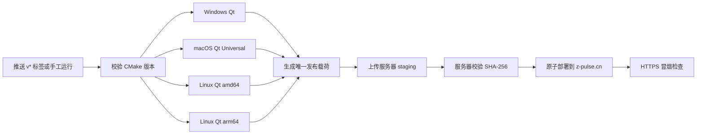

# GitHub Actions：Qt 四平台自动打包与 z-pulse.cn 自动部署

仓库通过 `.github/workflows/package.yml` 构建并部署 Qt/C++ 客户端，不使用 Swift 客户端。

| 平台 | GitHub Runner | 发布文件 |
|---|---|---|
| Windows amd64 | `windows-2022` | MSI、便携 ZIP |
| macOS Universal | `macos-15` | 同时包含 arm64 与 x86_64 的 DMG |
| Linux amd64 | `ubuntu-22.04` | 自包含 DEB |
| Linux arm64 | `ubuntu-22.04-arm` | 自包含 DEB |

完整流程如下：



## 一、日常使用

### 只打包、不部署

进入 GitHub 仓库的 **Actions → Multi-platform packages → Run workflow**：

1. `edition` 选择 `domestic` 或 `international`；
2. `deploy_to_zpulse` 保持关闭；
3. 点击 **Run workflow**。

完成后在该次运行的 **Artifacts** 下载四个平台安装包。Artifacts 保留 14 天。

也可用命令行：

```powershell
gh workflow run package.yml `
  --repo wang1st/xlsone-private `
  --ref main `
  -f edition=domestic `
  -f deploy_to_zpulse=false
```

### 手工打包并部署

完成下文的一次性服务器配置后，可手工执行全流程：

```powershell
gh workflow run package.yml `
  --repo wang1st/xlsone-private `
  --ref main `
  -f edition=domestic `
  -f deploy_to_zpulse=true `
  -f changelog="本次更新说明"
```

`international` 包不会部署到 `z-pulse.cn`，即使误选了部署开关，部署 job 也会被跳过。

### 正式标签全自动部署

项目版本的唯一来源是 `cpp/CMakeLists.txt`。正式标签必须指向一个已经合并并推送到 GitHub `main` 的提交。若仓库保护 `main`，先通过 PR 合并版本修改；随后在本机同步 `main`，确认版本，再创建标签：

```powershell
git switch main
git pull --ff-only github main
python scripts/ci/release_version.py

# 若允许直接维护 main，版本修改提交后必须先推送 main；受保护分支则以已合并 PR 为准。
git push github main
git tag -a v1.0.7 -m "xlsOne 1.0.7"
git push github v1.0.7
```

不要只推标签而遗漏 `main`：工作流会校验标签提交确实属于远端 `main`，否则在打包前失败。

正式的 `v<主版本>.<次版本>.<修订版本>` 标签默认构建国内版。四个平台成功后会启动两个相互独立的后续 job：

- Release job 创建 Draft GitHub Release；
- 部署 job 从本次真实安装包生成 `version.json` 与 `checksums.txt`，上传到服务器临时目录，在服务器重新校验五个安装文件的 SHA-256，部署安装包，最后切换在线 `version.json`，再检查在线清单、校验文件及五个下载地址。

这两个 job 可能并行，彼此不作为成功门槛。生产部署成功不代表 Draft Release 一定创建成功，发版后必须分别检查两者状态。

`v1.0.7-rc.1` 之类的预发布标签只生成 Draft/Prerelease，不部署生产站点。仓库变量 `RELEASE_EDITION` 应保持未设置或设为 `domestic`；若设为 `international`，生产部署会被安全跳过。标签必须指向已经合并到 `main` 的提交。

## 二、生成文件不再入库

以下文件是部署产物，已由 `.gitignore` 忽略，不再提交：

```text
site/api/version.json
site/downloads/checksums.txt
```

Actions 使用 `scripts/ci/prepare_zpulse_release.py` 从本次构建产物重新生成它们。这样不会把旧版本哈希或本机包哈希误用于云端安装包。

发布到服务器的规范文件名固定为：

```text
xlsone-<version>-windows-amd64.msi
xlsone-<version>-windows-amd64.zip
xlsOne-<version>-macos-universal.dmg
xlsOne-<version>-linux-amd64.deb
xlsOne-<version>-linux-arm64.deb
```

## 三、一次性准备部署 SSH 密钥

部署密钥必须与产品授权用的 Ed25519 密钥完全分开。所有密钥的本机权威副本仍放在：

```text
C:\Users\Administrator\secrets.json
```

需要新增三个字段：

```text
ZPULSE_DEPLOY_SSH_PRIVATE_KEY
ZPULSE_DEPLOY_SSH_PUBLIC_KEY
ZPULSE_DEPLOY_KNOWN_HOSTS
```

其中只有私钥和 `known_hosts` 会上传到 GitHub Environment；部署公钥只安装到服务器。

### 1. 核验服务器主机公钥

通过云厂商控制台或已经可信的服务器会话运行：

```bash
cat /etc/ssh/ssh_host_ed25519_key.pub
ssh-keygen -lf /etc/ssh/ssh_host_ed25519_key.pub
```

人工核验指纹后，取公钥文件第二列作为“服务器主机公钥主体”。`known_hosts` 中的主机名必须与连接端口匹配：22 端口使用普通主机名，非 22 端口使用 `[主机]:端口`：

```text
z-pulse.cn ssh-ed25519 <服务器主机公钥主体>
[z-pulse.cn]:2222 ssh-ed25519 <服务器主机公钥主体>
```

不要在 Actions 中临时运行 `ssh-keyscan` 后直接信任结果。

### 2. 生成专用密钥并写入 secrets.json

下面脚本同时兼容 Windows PowerShell 5.1 与 PowerShell 7，需要本机已有 OpenSSH 和 Python 3。`$hostKeyBody` 只填写上一步核验过的公钥主体；脚本会根据端口构造正确的 `known_hosts` 主机字段。这里通过 `cmd.exe` 调用 `ssh-keygen`，是因为 Windows PowerShell 5.1 会丢失原生程序的空字符串参数，直接写 `ssh-keygen -N ""` 会失败；再由 Python 原子更新 JSON，避免旧版 PowerShell 序列化多行 OpenSSH 私钥时卡住。

```powershell
$secretFile = Join-Path $env:USERPROFILE "secrets.json"
$zpulseHost = "z-pulse.cn"
$zpulsePort = 22
$hostKeyBody = "<已核验的服务器主机公钥主体>"
if ($hostKeyBody.StartsWith("<") -or $hostKeyBody -notmatch '^[A-Za-z0-9+/]+={0,3}$') {
    throw "请先从可信服务器控制台填写并核验真实的 Ed25519 主机公钥主体"
}
$knownHostName = if ($zpulsePort -eq 22) { $zpulseHost } else { "[$zpulseHost]:$zpulsePort" }
$knownHostsLine = "$knownHostName ssh-ed25519 $hostKeyBody"
$tempKeyDir = Join-Path $env:TEMP ("xlsone-zpulse-key-" + [guid]::NewGuid().ToString("N"))
$keyPath = Join-Path $tempKeyDir "id_ed25519"

New-Item -ItemType Directory -Path $tempKeyDir | Out-Null
try {
    $env:XLSONE_ZPULSE_KEY_PATH = $keyPath
    cmd.exe /d /s /c 'ssh-keygen -q -t ed25519 -N "" -C "github-actions-xlsone" -f "%XLSONE_ZPULSE_KEY_PATH%"'
    if ($LASTEXITCODE -ne 0 -or -not (Test-Path -LiteralPath $keyPath)) {
        throw "生成部署密钥失败"
    }

    $privateKey = Get-Content -LiteralPath $keyPath -Raw
    $publicKey = ((Get-Content -LiteralPath "$keyPath.pub" -Raw).Trim() -split "\s+")[0..1] -join " "
    $env:XLSONE_ZPULSE_PRIVATE_KEY = $privateKey
    $env:XLSONE_ZPULSE_PUBLIC_KEY = $publicKey
    $env:XLSONE_ZPULSE_KNOWN_HOSTS = $knownHostsLine

    @'
import json
import os
import sys
from pathlib import Path

path = Path(sys.argv[1])
data = json.loads(path.read_text(encoding="utf-8-sig"))
if not isinstance(data, dict):
    raise SystemExit("secrets.json must contain a JSON object")
new_fields = {
    "ZPULSE_DEPLOY_SSH_PRIVATE_KEY": os.environ["XLSONE_ZPULSE_PRIVATE_KEY"],
    "ZPULSE_DEPLOY_SSH_PUBLIC_KEY": os.environ["XLSONE_ZPULSE_PUBLIC_KEY"],
    "ZPULSE_DEPLOY_KNOWN_HOSTS": os.environ["XLSONE_ZPULSE_KNOWN_HOSTS"],
}
existing = [name for name in new_fields if data.get(name)]
if existing:
    raise SystemExit(
        "refusing to overwrite existing deployment fields: " + ", ".join(existing)
    )
data.update(new_fields)
temporary = path.with_name(path.name + ".tmp")
temporary.write_text(
    json.dumps(data, indent=2, ensure_ascii=False) + "\n",
    encoding="utf-8",
)
os.replace(temporary, path)
'@ | python - $secretFile
    if ($LASTEXITCODE -ne 0) {
        throw "更新 secrets.json 失败"
    }
} finally {
    Remove-Item Env:\XLSONE_ZPULSE_KEY_PATH -ErrorAction SilentlyContinue
    Remove-Item Env:\XLSONE_ZPULSE_PRIVATE_KEY -ErrorAction SilentlyContinue
    Remove-Item Env:\XLSONE_ZPULSE_PUBLIC_KEY -ErrorAction SilentlyContinue
    Remove-Item Env:\XLSONE_ZPULSE_KNOWN_HOSTS -ErrorAction SilentlyContinue
    if (Test-Path -LiteralPath $tempKeyDir) {
        Remove-Item -LiteralPath $tempKeyDir -Recurse -Force
    }
}
```

脚本默认拒绝覆盖任何已有的 `ZPULSE_DEPLOY_*` 值，避免误轮换仍在使用的部署密钥。确需轮换时，先保持云控制台/root 会话可用，另存并核对旧配置，明确删除这三个旧字段后再生成；新公钥安装到服务器且 Actions 验证成功后，立即安全删除旧副本。

## 四、一次性配置 z-pulse.cn 服务器

仓库提供两个服务器脚本：

- `scripts/deploy/setup-zpulse-deploy-user.sh`：创建最小权限部署用户；
- `scripts/deploy/zpulse-promote.sh`：校验并原子发布安装包。

仓库通过 `.gitattributes` 强制所有 `*.sh` 使用 LF。不要用会重新保存成 CRLF 的编辑器另存服务器脚本；上传前可运行 `git ls-files --eol scripts/deploy/*.sh`，确认索引和工作区均为 `lf`。

### 1. 安装服务器依赖

通过阿里云控制台或已经可信的 root 会话执行。脚本兼容 CentOS 7、Alibaba Cloud Linux 2/3 常见的 Bash 与 coreutils；最小系统仍需显式安装以下依赖：

```bash
set -e
if command -v dnf >/dev/null 2>&1; then
    dnf install -y sudo python3 util-linux coreutils shadow-utils policycoreutils
elif command -v yum >/dev/null 2>&1; then
    yum install -y sudo python3 util-linux coreutils shadow-utils policycoreutils
else
    echo "Unsupported package manager; install the required commands manually." >&2
    exit 1
fi

for command_name in bash python3 sha256sum realpath flock visudo useradd restorecon; do
    command -v "$command_name" >/dev/null || {
        echo "Missing command: $command_name" >&2
        exit 1
    }
done
```

若已经停止维护的 CentOS 7 镜像无法直接找到 `python3`，先按云厂商说明切换到仍可用的软件源，再安装 Python 3.6 或更高版本；不要替换系统自带的 `/usr/bin/python`。

### 2. 使用已核验的主机公钥完成首次安装

以下命令从 `secrets.json` 创建临时公钥文件和临时 `known_hosts`。所有 root SSH/SCP 都强制 `StrictHostKeyChecking=yes`，不会退回到“首次连接自动信任”。`$zpulsePort` 必须与生成 `ZPULSE_DEPLOY_KNOWN_HOSTS` 时使用的端口一致。

```powershell
$secretFile = Join-Path $env:USERPROFILE "secrets.json"
$data = Get-Content -LiteralPath $secretFile -Raw | ConvertFrom-Json
$zpulseHost = "z-pulse.cn"
$zpulsePort = 22
$tempSetupDir = Join-Path $env:TEMP ("xlsone-zpulse-setup-" + [guid]::NewGuid().ToString("N"))
$publicKeyFile = Join-Path $tempSetupDir "deploy.pub"
$knownHostsFile = Join-Path $tempSetupDir "known_hosts"
$utf8NoBom = New-Object System.Text.UTF8Encoding($false)

New-Item -ItemType Directory -Path $tempSetupDir | Out-Null
try {
    $publicKey = ([string]$data.ZPULSE_DEPLOY_SSH_PUBLIC_KEY).Trim()
    $knownHosts = ([string]$data.ZPULSE_DEPLOY_KNOWN_HOSTS).Replace("`r", "").Trim()
    if (-not $publicKey -or -not $knownHosts) {
        throw "secrets.json 缺少部署公钥或 known_hosts"
    }
    [IO.File]::WriteAllText($publicKeyFile, $publicKey, [Text.Encoding]::ASCII)
    [IO.File]::WriteAllText($knownHostsFile, $knownHosts + "`n", $utf8NoBom)

    $sshOptions = @(
        "-p", "$zpulsePort",
        "-o", "BatchMode=no",
        "-o", "StrictHostKeyChecking=yes",
        "-o", "UserKnownHostsFile=$knownHostsFile"
    )
    $scpOptions = @(
        "-P", "$zpulsePort",
        "-o", "StrictHostKeyChecking=yes",
        "-o", "UserKnownHostsFile=$knownHostsFile"
    )
    $rootTarget = "root@$zpulseHost"

    & ssh @sshOptions $rootTarget "mkdir -p /root/xlsone-deploy-setup"
    if ($LASTEXITCODE -ne 0) { throw "创建服务器临时目录失败" }

    & scp @scpOptions (Resolve-Path "scripts/deploy/setup-zpulse-deploy-user.sh").Path "${rootTarget}:/root/xlsone-deploy-setup/"
    if ($LASTEXITCODE -ne 0) { throw "上传 setup 脚本失败" }
    & scp @scpOptions (Resolve-Path "scripts/deploy/zpulse-promote.sh").Path "${rootTarget}:/root/xlsone-deploy-setup/"
    if ($LASTEXITCODE -ne 0) { throw "上传 promote 脚本失败" }
    & scp @scpOptions $publicKeyFile "${rootTarget}:/root/xlsone-deploy-setup/deploy.pub"
    if ($LASTEXITCODE -ne 0) { throw "上传部署公钥失败" }

    $remoteSetup = 'cd /root/xlsone-deploy-setup && export ZPULSE_DEPLOY_PUBLIC_KEY="$(cat deploy.pub)" && bash setup-zpulse-deploy-user.sh && if command -v restorecon >/dev/null 2>&1; then restorecon -RF /home/xlsone-deploy/.ssh /usr/local/sbin/xlsone-promote /srv/xlsone-upload; fi && rm -f deploy.pub'
    & ssh @sshOptions $rootTarget $remoteSetup
    if ($LASTEXITCODE -ne 0) { throw "服务器部署用户配置失败" }
} finally {
    if (Test-Path -LiteralPath $tempSetupDir) {
        Remove-Item -LiteralPath $tempSetupDir -Recurse -Force
    }
}
```

脚本会创建受限的非 root SSH shell（不是 SSH forced-command）：

- 创建无密码的 `xlsone-deploy` 用户；
- 禁止该密钥使用 PTY、端口转发和 Agent 转发；
- 账号只可写 `/srv/xlsone-upload/incoming`，不能写 root 所有的 `processing` 或线上目录；
- 安装 root 所有的 `/usr/local/sbin/xlsone-promote`；
- 只授权部署用户通过 `sudo` 调用固定发布脚本。

`restorecon` 用于恢复 SELinux 上的 SSH 与可执行文件标签；不要通过关闭 SELinux 来绕过标签问题。先完成下文的 GitHub Environment 配置并成功跑通一次部署，确认专用密钥和云厂商控制台都可用，再轮换旧 root 密码。在保留一个控制台会话的前提下，把 `sshd_config` 中的 root/password 登录策略收紧，先执行 `sshd -t`，确认无误后再 `systemctl reload sshd`，避免把自己锁在服务器外。

仓库历史文档曾包含服务器登录凭据，因此旧密码必须轮换；旧密码和 root 私钥都不得写入 GitHub Secrets。

## 五、配置 GitHub Environment

读取本机 `secrets.json`，先把客户端构建需要的公钥设置成**仓库级 Secret**，再创建生产 Environment 并上传部署所需的最小集合。`ED25519_PUBLIC_KEY` 必须是 64 位十六进制公钥；它不是私钥，但构建 job 不绑定生产 Environment，因此不能只放在 Environment 中。

```powershell
$repo = "wang1st/xlsone-private"
$data = Get-Content (Join-Path $env:USERPROFILE "secrets.json") -Raw | ConvertFrom-Json

if ([string]$data.ED25519_PUBLIC_KEY -notmatch '^[0-9a-fA-F]{64}$') {
    throw "ED25519_PUBLIC_KEY 必须是 64 位十六进制公钥"
}
gh secret set ED25519_PUBLIC_KEY --body ([string]$data.ED25519_PUBLIC_KEY) --repo $repo

gh api --method PUT "repos/$repo/environments/zpulse-production"
gh secret set ZPULSE_DEPLOY_SSH_PRIVATE_KEY --body ([string]$data.ZPULSE_DEPLOY_SSH_PRIVATE_KEY) --env zpulse-production --repo $repo
gh secret set ZPULSE_DEPLOY_KNOWN_HOSTS --body ([string]$data.ZPULSE_DEPLOY_KNOWN_HOSTS) --env zpulse-production --repo $repo

gh variable set ZPULSE_HOST --body "z-pulse.cn" --env zpulse-production --repo $repo
gh variable set ZPULSE_PORT --body "22" --env zpulse-production --repo $repo
gh variable set ZPULSE_USER --body "xlsone-deploy" --env zpulse-production --repo $repo
```

上述命令不会输出 Secret 内容。执行后用 `gh secret list --repo $repo` 与 `gh secret list --env zpulse-production --repo $repo` 只核对名称和更新时间，不要把 Secret 值打印到终端或日志。

随后进入 **Settings → Environments → zpulse-production → Deployment branches and tags**，选择 **Selected branches and tags**，分别添加 Branch `main` 与 Tag `v*.*.*`。不要添加通配分支；这样手工部署只能从 `main` 发起，标签部署只能来自正式版本标签模式。工作流本身还会再次校验精确稳定版标签和标签提交所属的 `main`。

不要上传以下值：

```text
ED25519_PRIVATE_KEY
ACTIVATION_SECRET
ADMIN_API_KEY
ZPULSE_DEPLOY_SSH_PUBLIC_KEY
服务器密码
```

若 Environment 配置了 Required reviewers，部署会等待人工批准；不配置 reviewer 时，正式标签会全自动部署。

## 六、首次验证

先用 `workflow_dispatch` 和 `deploy_to_zpulse=true` 做一次测试。成功标准：

```text
Windows amd64 (MSI + ZIP)       success
macOS universal (DMG)           success
Linux amd64 (DEB)               success
Linux arm64 (DEB)               success
Deploy domestic packages ...    success
```

然后检查：

```powershell
curl.exe -fsS https://z-pulse.cn/api/version
curl.exe -fsS https://z-pulse.cn/downloads/checksums.txt
```

Actions 的部署 job 还会对五个下载 URL 各做一次 Range 请求，并把版本、run ID 和线上地址写入 Step Summary。

## 七、失败与回滚

### 失败行为与保留策略

- 同版本同哈希重复部署：幂等成功；
- 同版本不同哈希：服务器拒绝覆盖，必须升级版本号；
- 任一包缺失、文件数不对或 SHA-256 不匹配：不会更新在线清单；
- 主机公钥变化：SSH 立即失败，先在服务器控制台核验，再更新 `ZPULSE_DEPLOY_KNOWN_HOSTS`；
- 旧安装包不会自动删除，便于回滚。

工作流会在上传失败时清理 `incoming`，服务器发布脚本也通过 EXIT trap 在成功或正常失败时清理 `incoming` 与 `processing`；校验失败不会把载荷当作长期调试副本保留。只有 runner 被强制终止、服务器宕机或进程收到无法捕获的 `SIGKILL` 时，才可能留下孤儿目录。GitHub 审计 Artifact 保留 14 天，成功发布形成的元数据备份至少保留 180 天；失败且已安全回滚的备份会自动删除。通过云厂商控制台或可信 root 会话，先暂停部署、打印超过 1 天的孤儿目录并人工确认，再清理；180 天备份也只在确认无需回滚后删除：

```bash
# 只列出候选项，不会删除。
find /srv/xlsone-upload/incoming -mindepth 1 -maxdepth 1 -type d -name 'run-*' -mtime +1 -print
find /srv/xlsone-upload/processing -mindepth 1 -maxdepth 1 -type d -name 'run-*' -mtime +1 -print
find /var/lib/xlsone-deploy/backups -mindepth 1 -maxdepth 1 -type d -name 'run-*' -mtime +180 -print

# 核对上面的绝对路径后再执行对应清理。
find /srv/xlsone-upload/incoming -mindepth 1 -maxdepth 1 -type d -name 'run-*' -mtime +1 -exec rm -rf -- {} +
find /srv/xlsone-upload/processing -mindepth 1 -maxdepth 1 -type d -name 'run-*' -mtime +1 -exec rm -rf -- {} +
find /var/lib/xlsone-deploy/backups -mindepth 1 -maxdepth 1 -type d -name 'run-*' -mtime +180 -exec rm -rf -- {} +
```

版本化安装包不参与上述自动清理。只有确认所有在线/回滚清单都不再引用某个旧包后，才可人工删除该包。

### 回滚三份元数据

每次发布前的三份在线元数据会备份到：

```text
/var/lib/xlsone-deploy/backups/run-<run-id>-<attempt>/
```

备份内分别是：公开清单 `version.json`、国内后端清单 `backend-version.json`、公开校验文件 `checksums.txt`。重复部署同一版本时，较新的备份可能已经是当前版本；先检查备份清单中的 `latest_version`，选择确实指向目标旧版本的目录。

通过阿里云控制台或可信 root 会话执行以下命令。三份文件先写入各自目标目录的临时文件，再原子改名；公开 `version.json` 必须最后切换：

```bash
set -euo pipefail
release_id="run-<需要回滚的 run-id>-<attempt>"
[[ "$release_id" =~ ^run-[0-9]+-[0-9]+$ ]]

backup="/var/lib/xlsone-deploy/backups/$release_id"
live_downloads="/var/www/z-pulse.cn/downloads"
live_api="/var/www/z-pulse.cn/api"
backend_api="/opt/xlsone-activation/site/api"

test -f "$backup/checksums.txt"
test -f "$backup/backend-version.json"
test -f "$backup/version.json"
python3 -c 'import json,sys; print("rollback target:", json.load(open(sys.argv[1], encoding="utf-8"))["latest_version"])' "$backup/version.json"

install -m 0644 "$backup/checksums.txt" "$live_downloads/.checksums.rollback.tmp"
install -m 0644 "$backup/backend-version.json" "$backend_api/.version.rollback.tmp"
install -m 0644 "$backup/version.json" "$live_api/.version.rollback.tmp"

mv "$live_downloads/.checksums.rollback.tmp" "$live_downloads/checksums.txt"
mv "$backend_api/.version.rollback.tmp" "$backend_api/version.json"
# 客户端读取的公开清单最后切换。
mv "$live_api/.version.rollback.tmp" "$live_api/version.json"

curl -fsS https://z-pulse.cn/api/version
curl -fsS https://z-pulse.cn/downloads/checksums.txt
```

回滚只切换元数据；版本化安装包仍保留在 `downloads/`。如果这是服务器第一次发布、备份中没有上一版三份文件，则不能用该目录回滚，应从已验证的上一版审计 Artifact 重新发布。

## 八、安全边界

- 自动部署只处理安装包、`version.json` 和 `checksums.txt`；不会部署激活服务密钥或数据库。
- `scripts/deploy/deploy.ps1` 与 `scripts/deploy/deploy.sh` 是历史人工应急入口，不被 Actions 调用。它们仍包含 root/密码兼容路径，并关闭了严格主机公钥校验，不满足本文正式发布的安全边界；不得用于无人值守或正式生产发布。正式发布统一使用 pinned `known_hosts`、专用部署用户和 `xlsone-promote`。
- 当前 Windows 包没有 Authenticode 签名，macOS 仅使用 ad-hoc 签名；自动部署成功不代表已完成商业代码签名或 Apple 公证。
- Qt 包使用 `ED25519_PUBLIC_KEY`；产品授权私钥永远不进入 GitHub Actions。
- GitHub 托管 runner 出口 IP 会变化。如果服务器只允许固定 IP，应改用自托管 runner 或 VPN。

## 九、本地验证命令

```powershell
python scripts/ci/release_version.py
python -m unittest discover -s scripts/ci/tests -p "test_*.py" -v
```

GitHub Actions YAML 还应使用 `actionlint` 检查。常规 C++ 编译测试位于 `.github/workflows/cpp-qt.yml`；Swift CI 与本自动发布流程无关。
