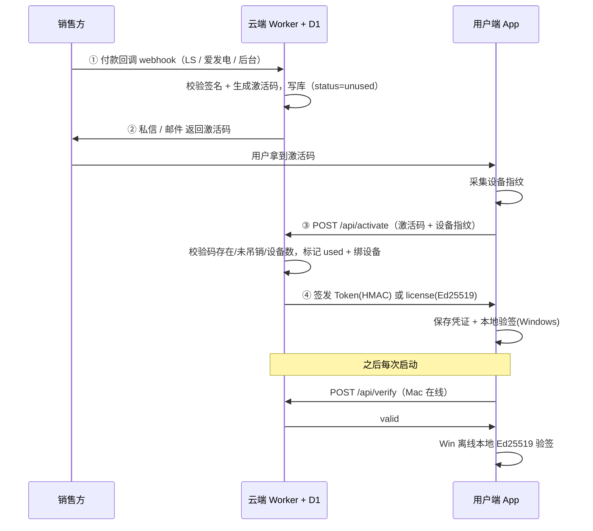

# 表表归一（xlsOne）授权分发与验证机制设计文档

> 版本：2026-07-08 · 维护者：xlsOne 开发组
> 适用范围：macOS 版（HMAC/JWT 在线验签）与 Windows 版（Ed25519 签名文件离线验签）
> 配套代码：`Sources/xlsOneLicense/`、`cpp/core/src/license_manager.cpp`、`activation/worker/src/index.ts`

---

## 1. 概述

表表归一的授权体系由三方协作完成。理解它的关键，是把"**销售方发码**"和"**用户端验证**"看成同一条链路的两端，而把它们连起来的"桥"，是跑在 `api.xlsone.com` 上的 Cloudflare Worker + D1 数据库。

| 角色 | 职责 | 代码位置 |
|------|------|----------|
| 销售方 | 收款并触发激活码生成（或后台批量生成） | Lemon Squeezy / 爱发电 Webhook、`/api/admin/*` |
| 云端 Worker + D1 | 校验回调、生成/签发激活凭证、维护码的状态机 | `activation/worker/src/index.ts`、`schema.sql` |
| 用户端 App | 采集设备指纹、向 Worker 激活、本地验证、解锁功能 | `Sources/xlsOneLicense/`、`cpp/core/src/license_manager.cpp` |

两条产品线采用**两套不同的密码学方案**：

- **macOS 版（在线为主）**：用 HMAC-SHA256 对一个 JWT 式 Token 签名，客户端存 Keychain，**每次启动联网向服务器核验**。
- **Windows 版（离线优先）**：用 Ed25519 对"许可证文件"做数字签名，客户端**内嵌公钥、本地离线验签**，无需联网。

> 之所以分两套：Mac 端追求简单、依赖 Apple 生态；Windows 端需要服务国内"内网/断网"用户，所以设计为可完全离线验证。

---

## 2. 整体握手流程



销售方与终端用户**唯一的数据交集点**就是 D1 数据库与 Worker 接口：销售方写入一张 `unused` 的码，用户端拿去"激活"把它变成 `used` 并绑定设备；之后验证要么回头问云端（Mac），要么靠云端当初签好的封印自己判断（Windows）。

---

## 3. macOS 版（HMAC / JWT 在线验签）

### 3.1 收款与发码
- 用户在官网下单，Lemon Squeezy 付款成功后向 `POST /api/webhook/lemonsqueezy` 打回调。
- Worker 用 `LEMON_SQUEEZY_SIGNING_SECRET` 校验回调签名，调用 `generateKeyId()` 生成 `XXXX-XXXX-XXXX` 格式激活码，写入 `activation_keys` 表（状态 `unused`，记录档位与到期日）。
- 计划通过邮件自动下发（Resend/SendGrid，待接）。

### 3.2 设备标识
- Mac 端**不采硬件序列号**，而是在 Keychain 中存一个 UUID 并对其做 SHA256，作为 `device_id`。换硬件不影响授权，也不触碰 IOKit。

### 3.3 激活（`POST /api/activate`）
- 客户端携带 `激活码 + device_id + device_name` 请求激活。
- Worker 校验：码存在？未吊销？设备数未超额？通过后用 HMAC-SHA256（密钥 `ACTIVATION_SECRET`）签发一个 JWT 式 Token，载荷含 `sub=码`、`dev=device_id`、`plan`、`iat`、`exp`。
- 客户端把 Token 存入 Keychain，功能解锁。

### 3.4 验证与刷新
- 启动调用 `POST /api/verify`，服务器重算 HMAC 确认未被篡改、未过期、设备未被吊销。
- **离线兜底**：断网时本地校验 JWT（`exp` / `dev` 匹配），并有 **7 天宽限期**（只要近一周内验证过即可离线使用）。
- Token 有效期 30 天，临近到期（7 天内）由 `POST /api/refresh` 滚动续期。

### 3.5 档位
- `personal_yearly` / `personal_lifetime` / 订阅型。Mac App Store 分发版（`app_store`）**常驻视为已激活**，不进此流程。

---

## 4. Windows 版（Ed25519 签名文件离线验签）

### 4.1 收款与发码
- 用户通过爱发电付款，回调 `POST /api/webhook/afdian`。
- Worker 对**原始 `data` 字符串**（不能先 JSON 解析再拼回）做 MD5 签名校验（`AFDIAN_TOKEN`），并做幂等去重（同一订单只发一次）。
- 调用 `generateKeyId()` 生成 `XLS1-XXXX-XXXX` 格式码，写入 `windows_keys` 表，再通过爱发电私信 API 自动发给用户。

### 4.2 设备指纹
- 采集 **主板序列号、CPU ID、系统盘序列号、注册表 `MachineGuid`** 四项，分别 SHA256 后组合成 `device_hash`；同时保留各项 `device_components` 列表。

### 4.3 激活（`POST /api/activate/windows`）
- 客户端携带 `激活码 + device_hash + device_components` 请求激活。
- Worker 校验码状态/设备数后，用 **Ed25519 私钥**对许可证内容签名，返回完整的带 `signature` 的 JSON license。
- 客户端用**内嵌公钥**在本地验证签名（可离线），通过则保存为本地 `.license`。

### 4.4 本地验签（无需联网）
- 启动时从本地读出 `.license`，用内嵌公钥验 Ed25519 签名，并检查：
  - 设备绑定：精确匹配 `device_hash`；否则回退到 **2/3 组件部分匹配**（换硬盘等小改动仍认同一台机器）。
  - 过期时间：`expires_at`。
- 这使得 Windows 版**完全可离线运行**，契合国内内网环境。

### 4.5 换机迁移
- 再次激活时若设备指纹与库内不同，Worker 查 `windows_device_migrations`，当**当年换机次数 < 3** 时：记录迁移、吊销旧设备、绑定新机。

---

## 5. 云端数据模型（D1）

| 表 | 关键字段 | 说明 |
|----|----------|------|
| `activation_keys` | `key_id, order_id, plan, status, device_id, expires_at, created_at` | Mac 激活码；`status`: unused→used→revoked |
| `windows_keys` | `key_id, order_id, plan, status, device_hash, device_components, created_at` | Windows 激活码；同样的状态机 |
| `windows_devices` | `key_id, device_hash, device_name, activated_at` | 已绑定设备 |
| `windows_device_migrations` | `key_id, from_hash, to_hash, migrated_at` | 换机记录（限 3 次/年） |
| `orders` | `order_id, source, status, created_at` | 订单/幂等去重 |
| `usage_logs` | `key_id, event, ip, created_at` | 行为审计 |

**激活码状态机**：`unused` →（激活成功）→ `used` →（风控/退款）→ `revoked`。Worker 在激活时校验 `status != 'revoked'` 与设备数上限；`KEY_REVOKED` / `DEVICE_LIMIT` 等错误直接返回对应中文提示。

**统一激活入口**（旧版 + Windows 版共用）：
- 限流：每 IP 单窗口内上限（内存级 `rateMap`，生产建议换 D1/KV）。
- 管理员接口：`/api/admin/generate`、`/api/admin/generate-windows-keys`（带 `Bearer` 密钥，可批量造码，用于企业/手动发放）。

---

## 6. 接口清单

| 端点 | 说明 |
|------|------|
| `POST /api/activate` | 旧版（Mac）HMAC/JWT 激活 |
| `POST /api/verify` | 验证 Mac Token |
| `POST /api/refresh` | 刷新 Mac Token |
| `POST /api/webhook/lemonsqueezy` | Lemon Squeezy 订单回调 |
| `POST /api/admin/generate` | 旧版激活码批量生成 |
| `POST /api/activate/windows` | Windows Ed25519 许可证激活 |
| `POST /api/license/download` | 离线激活：下载签名授权文件 |
| `POST /api/webhook/afdian` | 爱发电订单回调（Windows） |
| `POST /api/admin/generate-windows-keys` | Windows 激活码批量生成 |
| `GET /api/health` | 健康检查 |

---

## 7. 安全设计

- **Mac Token**：JWT 式 HMAC-SHA256，30 天滚动刷新；私钥 `ACTIVATION_SECRET` 仅存 Worker Secret。
- **Windows 授权**：Ed25519 数字签名，客户端内置公钥本地验签；伪造者没有私钥就无法生成通过验证的 license。
- **设备绑定**：Windows 采硬件指纹组合哈希，支持 2/3 组件部分匹配，兼顾防滥用与换硬件容错。
- **密钥管理原则**：
  - 私钥（种子）**只存在于 Cloudflare Secret**（`wrangler secret put`），本地开发放 gitignored 的 `.dev.vars`，**绝不进源码或提交**。
  - 公钥内嵌在客户端（本就属于公开信息），用于本地验签。
- **已知边界**：定位"防君子不防小人"，不追求不可逆防破解；代码签名、反调试等作为可选增强（见 `docs/plans/2026-06-29-windows-license-encryption-payment.md`）。

### 7.1 Ed25519 密钥轮换事件（2026-07-08）
- 早期仓库中曾提交过一组**示例 Ed25519 种子（私钥）**，因此任何人都能用它伪造 Windows 授权。该示例种子已**作废**。
- 已于 2026-07-08 轮换为全新密钥对：
  - 新公钥已写入 `cpp/core/src/license_manager.cpp` 的 `kLicensePublicKey`。
  - 新私钥（64 位十六进制种子）仅写入 Cloudflare Secret（及本地 gitignored `.dev.vars`）。
- **轮换影响**：使用旧公钥编译的客户端将无法验证由新私钥签发的 license（反之亦然）。由于产品尚处早期、尚无大规模已分发 Windows 授权，本次轮换安全；若未来需在"不中断老用户"的前提下轮换，应改为"客户端信任多个公钥"的过渡方案（待设计）。
- **历史清理（建议）**：若该私钥曾推送至远程（Gitee），仅改工作区不足以从已公开的历史中抹除；如需彻底清理需 `git filter-repo` 重写历史并强制推送（需你的 Gitee PAT 与明确同意）。鉴于密钥已轮换失效，此举属"卫生"性质，非安全必需。

---

## 8. 国内可达性

| 端点 | 位置 | 目标 |
|------|------|------|
| `api.xlsone.com` | Cloudflare Workers | 海外 + 国内可通 |
| 阿里云 FC | 阿里云函数计算 | 国内兜底（TBD，已在代码中预留 `API.fallback`） |
| 离线授权文件 | 本地 | 内网/断网用户 |

免费策略：**Linux / ARM64（UOS、麒麟、飞腾、鲲鹏等）永久免费，常驻视为已激活**；Windows 付费（含 14 天全功能试用）。

---

## 9. 当前状态与待办

已完成：
- [x] **Ed25519 密钥对轮换（2026-07-08）**，消除示例私钥暴露风险。

待完成：
- [ ] 阿里云 FC 国内端点部署
- [ ] Lemon Squeezy webhook 实际对接测试
- [ ] 爱发电 webhook 实际对接测试
- [ ] 激活码邮件自动发送（Resend/SendGrid）
- [ ] 离线授权文件生成网页（`z-pulse.cn/offline`）
- [ ] macOS 端编译验证
- [ ] 反盗版：代码混淆（后期）
- [ ] （可选）生产密钥轮换的无缝过渡（多公钥信任）

---

## 附录 A：本地密钥文件说明

`.dev.vars`（已被 `.gitignore` 忽略，切勿提交）示例：

```
ED25519_PRIVATE_KEY=<64 位十六进制种子>
```

生产环境：

```bash
cd activation/worker
npx wrangler secret put ED25519_PRIVATE_KEY   # 64 位十六进制种子
```

轮换时重新生成种子，更新上述 Secret 与 `cpp/core/src/license_manager.cpp` 的 `kLicensePublicKey` 即可。生成命令参考（与 Worker 的 hex 格式对齐）：

```bash
openssl genpkey -algorithm ed25519 -outform DER -out ed25519_priv.der
SEED=$(dd if=ed25519_priv.der bs=1 skip=16 count=32 2>/dev/null | xxd -p | tr -d '\n')
PUB=$(openssl pkey -in ed25519_priv.der -inform DER -pubout -outform DER \
      | dd bs=1 skip=12 count=32 2>/dev/null | xxd -p | tr -d '\n')
echo "ED25519_PRIVATE_KEY=$SEED"
echo "PUBLIC_KEY=$PUB"
# 将 $SEED 写入 Wrangler Secret，将 $PUB 写进 cpp 的 kLicensePublicKey
```
