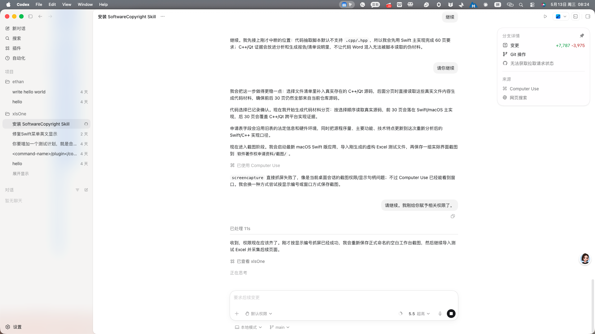
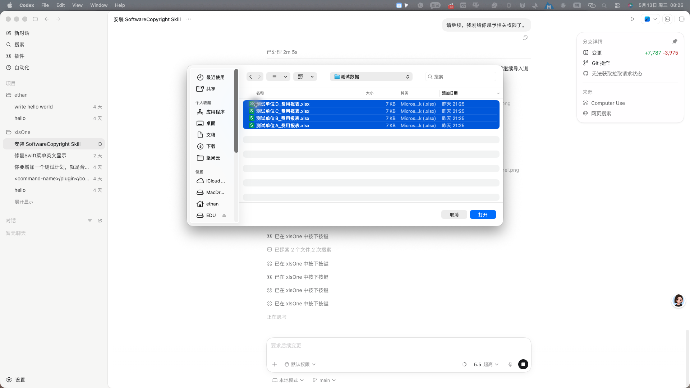
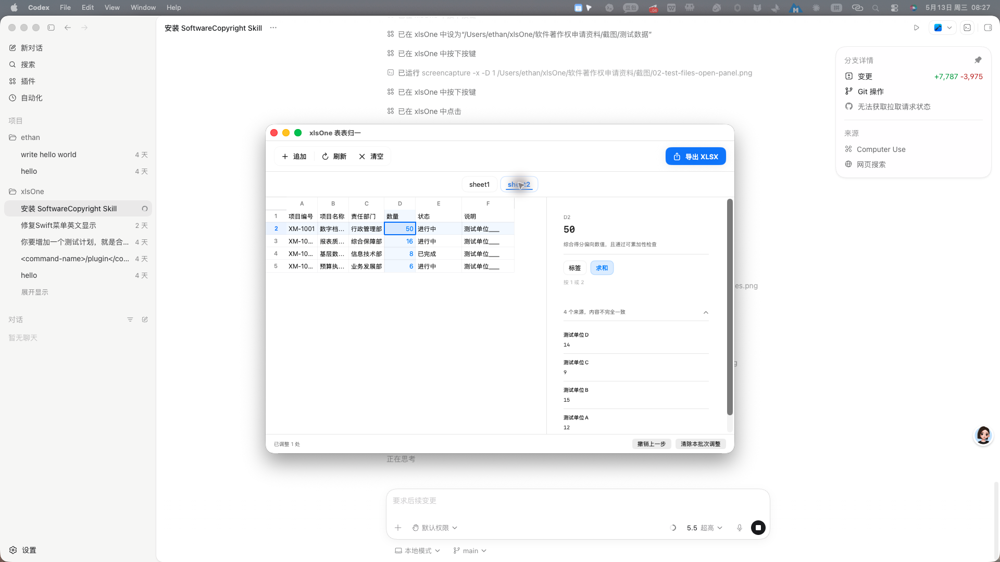
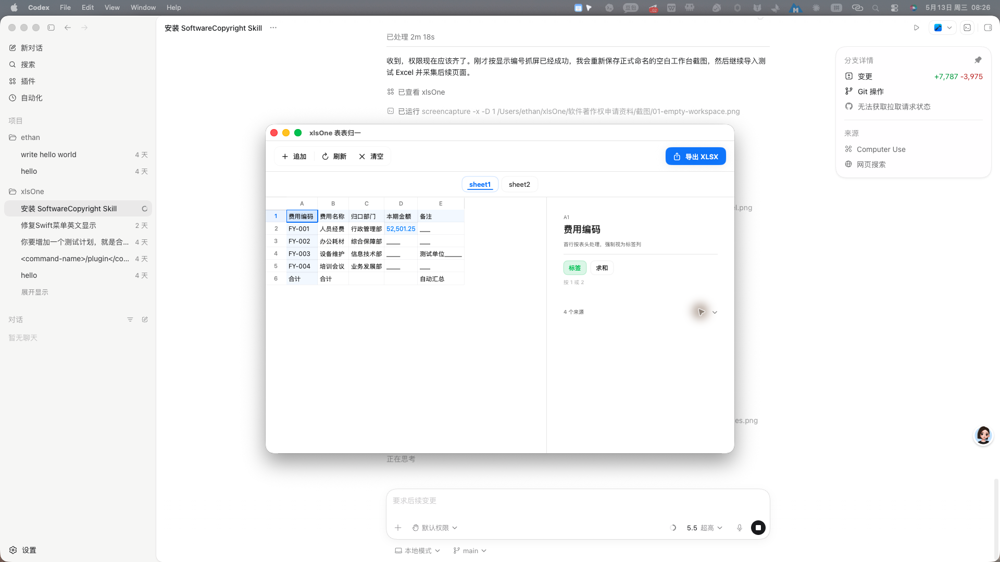
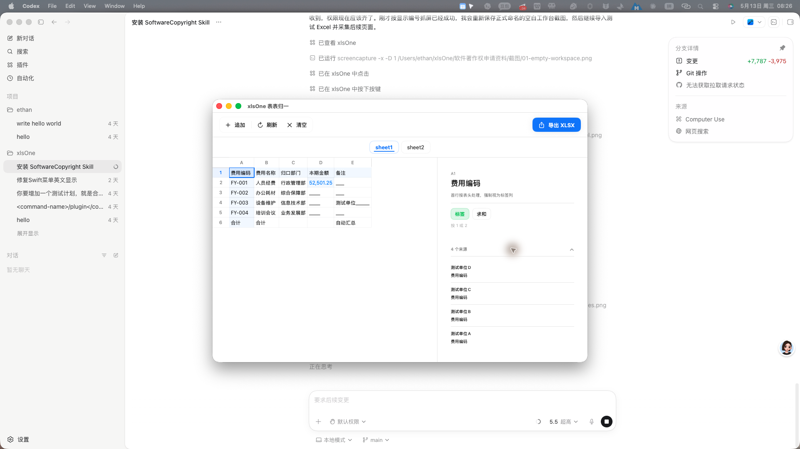
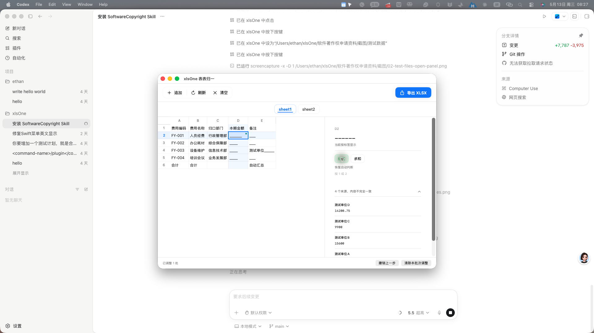
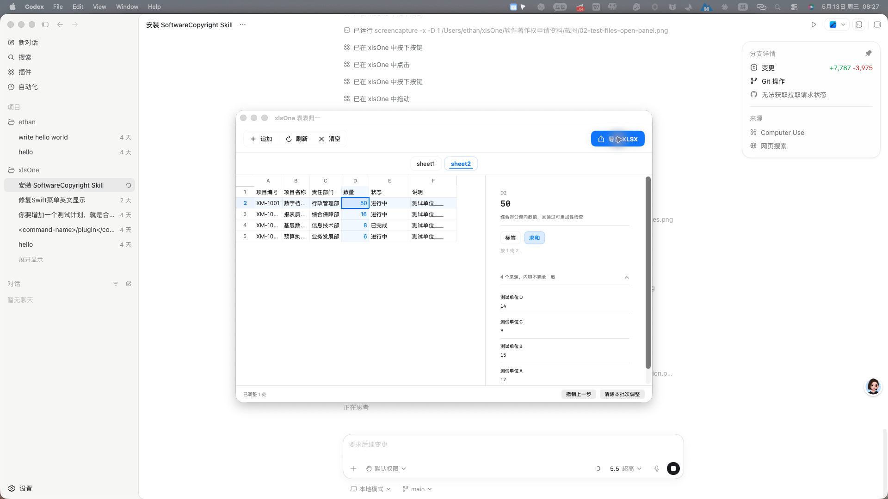

# 表表归一 V1.0.0 操作手册

## 1. 文档说明

本手册用于说明“表表归一 V1.0.0”的主要操作流程。软件用于把多份结构一致的 Excel 工作簿导入同一工作台，自动完成结构校验、Sheet 识别、单元格汇总、来源查看、类型修正和汇总结果导出。

本手册截图使用的 Excel 文件均为本次材料生成流程创建的虚构测试数据，文件保存在 `/Users/ethan/xlsOne/软件著作权申请资料/截图/测试数据/`，文件名为 `测试单位A_费用报表.xlsx`、`测试单位B_费用报表.xlsx`、`测试单位C_费用报表.xlsx`、`测试单位D_费用报表.xlsx`。这些文件仅用于演示截图，不含真实客户、政府或业务数据，也不作为代码材料来源。

## 2. 软件启动与空白工作台

启动软件后，窗口标题显示为“xlsOne 表表归一”。首次进入时，工作台中部显示 Excel 文件导入入口。用户可以拖入多个 `.xlsx` 或 `.xls` 文件，也可以点击“选择文件”打开系统文件选择窗口。空白状态下不会读取任何历史业务文件，只有在用户选择文件后才开始解析和校验。

## 3. 批量导入 Excel 文件

点击“选择文件”后，系统打开 macOS 文件选择窗口。用户进入测试数据目录后，可以一次选中多份 Excel 文件并点击“打开”。软件会把本批次文件作为同一组报表处理，后续汇总、校验和来源查看都围绕这一批文件展开。

文件导入后，软件先解析工作簿，再检查各文件是否存在可共同处理的 Sheet。截图中 4 个测试文件均参与处理，工作台顶部显示“追加、刷新、清空、导出 XLSX”等操作入口，并显示当前可切换的 Sheet。

## 4. 工作簿校验与 Sheet 切换

软件会按 Sheet 维度检查参与文件数量、有效行列范围和结构一致性。通过校验的 Sheet 会显示在工作台上方，例如截图中的 `sheet1`、`sheet2`。用户点击不同 Sheet 标签后，左侧网格和右侧详情面板会同步切换，便于在同一批文件中分别查看费用汇总表和项目明细表的结果。

当某个 Sheet 的结构可合并时，软件会给出参与文件数量和有效尺寸。若文件结构不一致，软件会阻止直接汇总并提示用户检查原始文件，避免把不同格式的表误合并。

## 5. 汇总结果查看

完成导入和校验后，软件在左侧以表格形式展示汇总结果。首行表头会按标签处理，编码、名称、部门等文本字段会尽量保留，金额或数量字段会进行求和；当多个来源内容不一致时，单元格会以差异形式展示，方便用户继续复核。

用户点击网格中的任意单元格，右侧详情面板会显示单元格坐标、当前汇总结果、系统判断理由和可选处理方式。金额字段会显示求和结果，文本字段会显示标签结果，差异字段会提示来源内容不完全一致。

## 6. 来源穿透与复核

右侧详情面板中的来源区域可以展开查看当前单元格来自哪些文件。展开后，软件列出每个测试单位对应的原始值，用户可以看到汇总值是由哪些来源组成，也能快速判断差异来自哪个文件。

来源穿透适用于金额、数量、编码、名称、备注等各类单元格。对于金额字段，面板会列出各来源数值；对于标签字段，面板会列出各来源文本。用户在复核时无需回到每一个原始 Excel 文件逐个查找。

## 7. 类型修正与调整记忆

软件会自动判断单元格应按“标签”还是“求和”处理。若用户认为自动判断不符合本批报表含义，可以在右侧详情面板点击“标签”或“求和”进行修正。修正后，网格中的结果会立即刷新，底部会显示已调整的数量，并提供“撤销上一步”和“清除本批次调整”入口。

调整会结合当前工作簿结构生成记忆，用于同类表格再次导入时复用。用户可以通过菜单中的规则/记忆管理入口查看和维护已保存的调整记录。为避免把历史业务名称写入本次材料，本手册不展示记忆管理窗口截图，仅说明当前界面中可见的本批次调整状态和恢复入口。

## 8. 导出汇总结果

确认汇总结果后，用户点击右上角“导出 XLSX”。软件弹出 macOS 保存对话框，默认按导入文件名称生成汇总文件名。用户可以修改保存名称和目录，点击“保存”后生成 `.xlsx` 汇总工作簿。

导出的工作簿用于后续归档、复核或再加工。导出操作不会修改原始测试文件，也不会改变当前工作台中已导入文件的内容。

## 9. 许可证与授权状态

软件包含许可证激活与授权状态管理模块。未激活或授权异常时，软件可显示授权相关提示；用户按授权信息完成激活后，软件保存本机授权状态并继续提供 Excel 汇总功能。授权模块与工作台功能分离，不影响对本批测试文件的解析、校验、汇总和导出说明。

## 10. 常见处理方式

如果导入后没有出现汇总结果，先确认所选文件是否均为 `.xlsx` 或 `.xls`，并检查多个文件的 Sheet 数量、Sheet 名称、行列结构是否一致。若某些单元格结果看起来不像预期，可点击该单元格查看来源，再通过“标签/求和”进行修正。若需要重新开始，可点击“清空”移除当前工作区中的文件，然后重新导入。

如果只是原始文件内容有少量不同，不必重新整理全部报表；用户可以通过来源穿透定位差异，再决定保留、修正或回到原始 Excel 修改。完成复核后再执行导出，可减少手工复制和重复核算。
